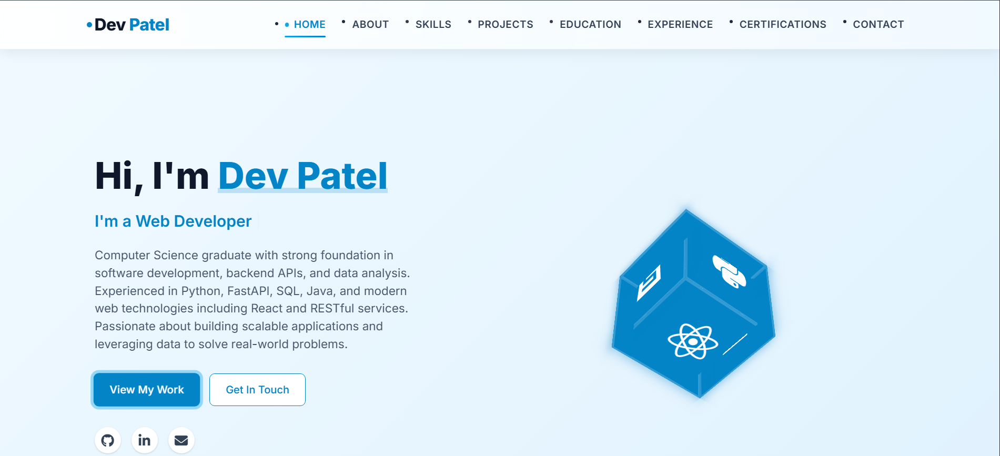

# 🚀 Dev Patel — Portfolio Website

A modern, elegant, and fully responsive portfolio website built to showcase the skills, projects, and background of **Dev Patel**, a Computer Science & Engineering graduate passionate about backend development, data analysis, and scalable web apps.

🔗 **Live Demo**: (dev-portfolio-bice-gamma.vercel.app
)

---



---

## ✨ Features

- 🔹 **Responsive Design** — Optimized for desktop, tablet, and mobile
- 🔹 **Animated 3D Skills Cube** — Showcasing technologies like Python, HTML, CSS, Java
- 🔹 **Smooth Navigation** — Sticky navbar, smooth scroll, and section highlighting
- 🔹 **Interactive Contact Form** — With basic validation
- 🔹 **Project Showcase** — Filterable cards linking to live demos & GitHub
- 🔹 **Modern UI/UX** — Professional layout with clean fonts and accessible design

---

## 🛠️ Tech Stack

### 🔧 Core Technologies
- **HTML5** – Semantic structure
- **CSS3** – Flexbox, Grid, Animations, Variables
- **JavaScript (ES6+)** – DOM manipulation, interactive elements

### 🧩 UI/Assets
- **Font Awesome** – Icons
- **Google Fonts** – Typography
- **Custom 3D Cube Animation** – CSS-powered rotating cube for tech stack

---

## 📁 Folder Structure

portfolio/
├── index.html # Main entry point
├── css/
│ └── style.css # All styles and themes
├── js/
│ └── script.js # JS logic for interactivity
├── images/ # Profile, projects, preview screenshots
└── README.md # Project documentation

---

## 🚀 Getting Started

To run this website locally:

1. **Clone** the repository:
   ```bash
   git clone ()
   cd portfolio

2  Open index.html in your preferred web browser.


## 🧾 License
This project is licensed under the MIT License — feel free to fork and use it for your personal portfolio.

## 📬 Contact
Connect with me:

🔗 LinkedIn:https://www.linkedin.com/in/devpatel16/

💻 GitHub: https://github.com/dev568

📩 Via [Contact Form] on the website


Designed & built with ❤️ by Dev Patel
